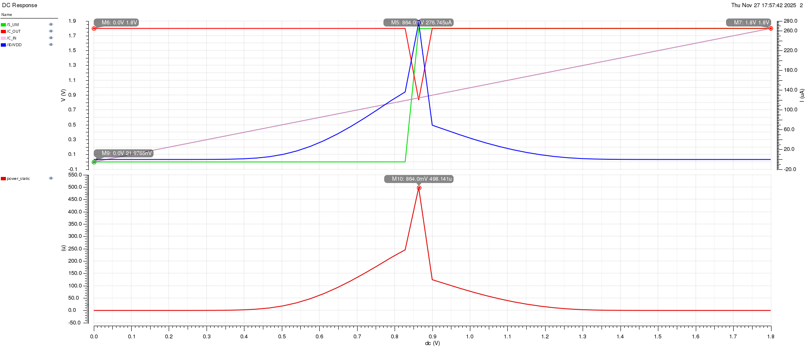
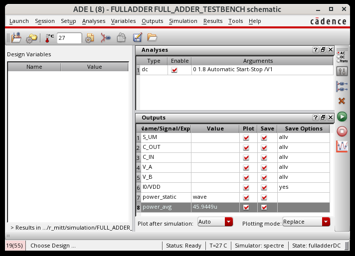
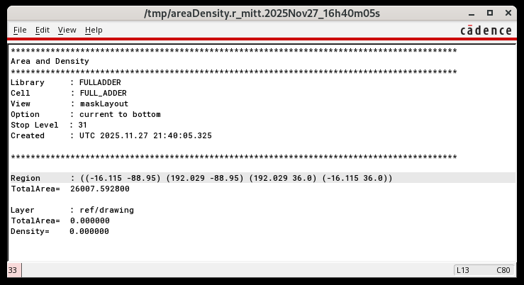
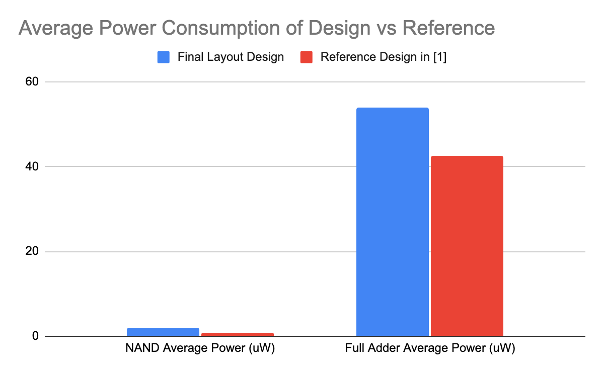
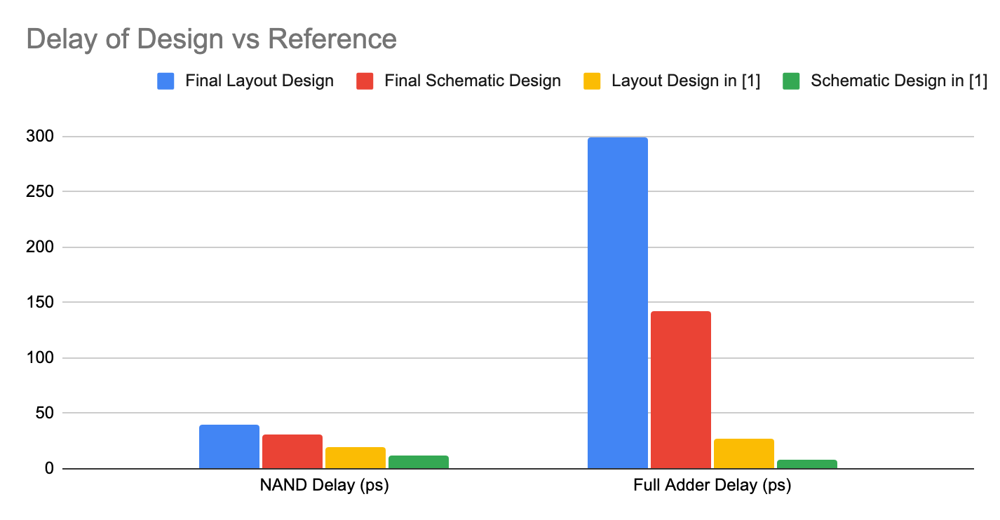

# NAND-Based Full Adder (180 nm CMOS)

A 1-bit NAND-based full adder implemented in 180 nm CMOS, including schematic design, layout, DRC/LVS verification, parasitic extraction (Calibre PEX), and post-layout simulation. The full adder is built from 9 NAND gates (36 transistors total).

## Why This Matters
This project demonstrates end-to-end VLSI flow ownership: transistor-level design, physical layout, verification, parasitic-aware simulation, and performance analysis. It maps directly to core digital/ASIC design skills recruiters look for.

## Highlights
- Post-layout average dynamic power: 62.6 uW
- Post-layout propagation delay to Sum (with output load): 353.5 ps
- Layout silicon area: 26007.59 um^2
- DRC/LVS clean; PEX-based post-layout simulations

## Results (Full Adder Specifications)
Values are reported in the project report table for schematic/layout and with/without output load.

| Metric | Schematic (No Load) | Schematic (With Load) | Layout (No Load) | Layout (With Load) |
| --- | --- | --- | --- | --- |
| Delay to Sum (ps) | 142.3 | 161.6 | 298.9 | 353.5 |
| Delay to Carry (ps) | 42.37 | 53.43 | 144.146 | 179.46 |
| Avg. Dynamic Power (uW) | - | - | - | 62.6 |
| Silicon Area (um^2) | - | - | 26007.59 | - |

## What I Did
- Designed CMOS NAND gate at transistor level and sized devices for delay/power tradeoffs.
- Built a 1-bit full adder using 9 NAND gates and verified logic correctness.
- Completed layout and ran DRC/LVS to confirm manufacturability and schematic match.
- Performed parasitic extraction (Calibre PEX) and post-layout transient simulations.
- Analyzed post-layout timing/power impact and documented results.

## Toolchain
- Cadence Virtuoso for schematic and layout
- Spectre for simulation
- Calibre for DRC, LVS, and PEX
- 180 nm PDK and rule decks (not included)

## Key Figures
A quick visual summary. Full figure set is below.

| | |
| --- | --- |
|  |  |
|  |  |
|  |  |
|  |  |

## Full Figure Set (No Need to Open the Report)
All images were extracted from `docs/Report.pdf` so the entire project can be reviewed from here.

**Figure 01** (951x827)

**Figure 02** (948x826)

**Figure 03** (979x821)

**Figure 04** (894x816)

**Figure 05** (1504x1027)

**Figure 06** (1504x1027)

**Figure 07** (2048x730)

**Figure 08** (2048x730)

**Figure 09** (2048x1228)

**Figure 10** (1009x914)

**Figure 11** (1009x914)

**Figure 12** (1714x777)

**Figure 13** (1239x818)

**Figure 14** (1602x828)

**Figure 15** (758x514)

**Figure 16** (758x514)

**Figure 17** (758x514)

**Figure 18** (758x514)

**Figure 19** (1916x828)

**Figure 20** (712x514)

**Figure 21** (1916x828)

**Figure 22** (712x514)

**Figure 23** (1731x828)

**Figure 24** (1731x828)

**Figure 25** (1916x828)

**Figure 26** (1602x828)

**Figure 27** (712x514)

**Figure 28** (601x514)

**Figure 29** (712x514)

**Figure 30** (601x514)

**Figure 31** (712x514)

**Figure 32** (601x514)

**Figure 33** (712x514)

**Figure 34** (601x514)

**Figure 35** (712x514)

**Figure 36** (712x514)

**Figure 37** (1916x828)

**Figure 38** (739x402)

**Figure 39** (1200x742)

**Figure 40** (739x402)

**Figure 41** (1426x742)

**Figure 42** (545x632)

**Figure 43** (871x632)

**Figure 44** (871x632)

**Figure 45** (871x632)

**Figure 46** (545x632)

**Figure 47** (871x632)

**Figure 48** (871x632)

**Figure 49** (871x632)

## Repository Structure
- `FULLADDER/FULL_ADDER/`: full adder cell/library data
- `FULLADDER/NAND/`: NAND gate cell/library data
- `FULLADDER/*_TESTBENCH/`: testbenches
- `docs/Report.pdf`: sanitized project report
- `docs/images/extracted/`: images extracted from the report
- `*.sp`, `*.pex.netlist`: netlists (generated)
- `*_drc*`, `*_lvs*`, `*_erc*`: verification outputs

## Notes
- Foundry PDK and proprietary rule decks are not included.
- Netlists and verification outputs are generated artifacts and are typically excluded from version control.
