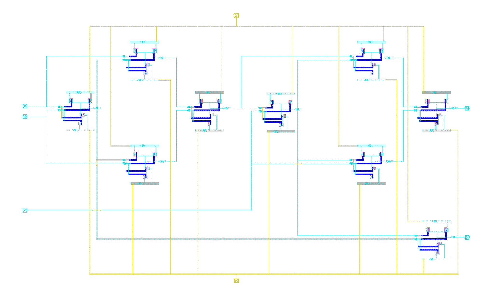

# NAND-Based Full Adder (180 nm CMOS)

A 1-bit NAND-based full adder implemented in 180 nm CMOS, including schematic design, layout, DRC/LVS verification, parasitic extraction (Calibre PEX), and post-layout simulation. The full adder is built from 9 NAND gates (36 transistors total).

> [!IMPORTANT]
> Full simulation waveforms, detailed measurements, and analysis are in **[docs/Report.pdf](docs/Report.pdf)**.

**Highlights**
- Post-layout average dynamic power: 62.6 uW
- Post-layout propagation delay to Sum (with output load): 353.5 ps
- Layout silicon area: 26,007.59 um^2
- DRC/LVS clean; PEX-based post-layout simulations

**Results (Full Adder Specifications)**
Values are reported in the project report table for schematic/layout and with/without output load.

| Metric | Schematic (No Load) | Schematic (With Load) | Layout (No Load) | Layout (With Load) |
| --- | --- | --- | --- | --- |
| Delay to Sum (ps) | 142.3 | 161.6 | 298.9 | 353.5 |
| Delay to Carry (ps) | 42.37 | 53.43 | 144.146 | 179.46 |
| Avg. Dynamic Power (uW) | - | - | - | 62.6 |
| Silicon Area (um^2) | - | - | 26007.59 | - |

**Schematic And Layout**

NAND gate views are shown first.

Shown below is **Figure 3: CMOS NAND Gate Schematic**.

Shown below is **Figure 4: NAND Gate Layout**.

Full adder views are shown next.

Shown below is **Figure 7: Full Adder Schematic with Numbered Gates**.

Shown below is **Figure 8: Full Adder Layout**.

**Toolchain**
- Cadence Virtuoso for schematic and layout
- Spectre for simulation
- Calibre for DRC, LVS, and PEX
- 180 nm PDK and rule decks (not included)

**For Full Details**
For full simulations, PEX netlists, DRC/LVS reports, plots, and analysis, see **[docs/Report.pdf](docs/Report.pdf)**.

**Repository Structure**
- `FULLADDER/FULL_ADDER/`: full adder cell/library data
- `FULLADDER/NAND/`: NAND gate cell/library data
- `FULLADDER/*_TESTBENCH/`: testbenches
- `docs/Report.pdf`: sanitized project report
- `docs/images/extracted/`: images extracted from the report
- `*.sp`, `*.pex.netlist`: netlists (generated)
- `*_drc*`, `*_lvs*`, `*_erc*`: verification outputs

**Notes**
- Foundry PDK and proprietary rule decks are not included.
- Netlists and verification outputs are generated artifacts and are typically excluded from version control.

**Simulation Snapshot (From `docs/Report.pdf`)**

Full-adder transient verification was run in Spectre with `tran 0 100n conservative`, `VDD = 1.8 V`, and staggered pulse sources on `VA`, `VB`, and `CIN` to sweep input combinations over time.

| Case | Delay to Carry (ps) | Delay to Sum (ps) | Avg. Power (uW) |
| --- | --- | --- | --- |
| Schematic (No Load) | 42.369 | 142.316 | 27.937 |
| Schematic (With Load) | 53.434 | 161.592 | 31.266 |
| Layout (No Load) | 144.146 | 298.897 | 53.852 |
| Layout (With Load) | 179.457 | 353.543 | 62.623 |

Representative functional checks (from transient waveforms):

| A | B | Cin | Sum | Cout |
| --- | --- | --- | --- | --- |
| 0 | 0 | 0 | 0 | 0 |
| 0 | 0 | 1 | 1 | 0 |
| 0 | 1 | 1 | 0 | 1 |
| 1 | 1 | 1 | 1 | 1 |

**Simulation Results**

Simulation details are omitted here for brevity. Check **[docs/Report.pdf](docs/Report.pdf)** for more details (waveforms, delay/power measurements, and full analysis).
